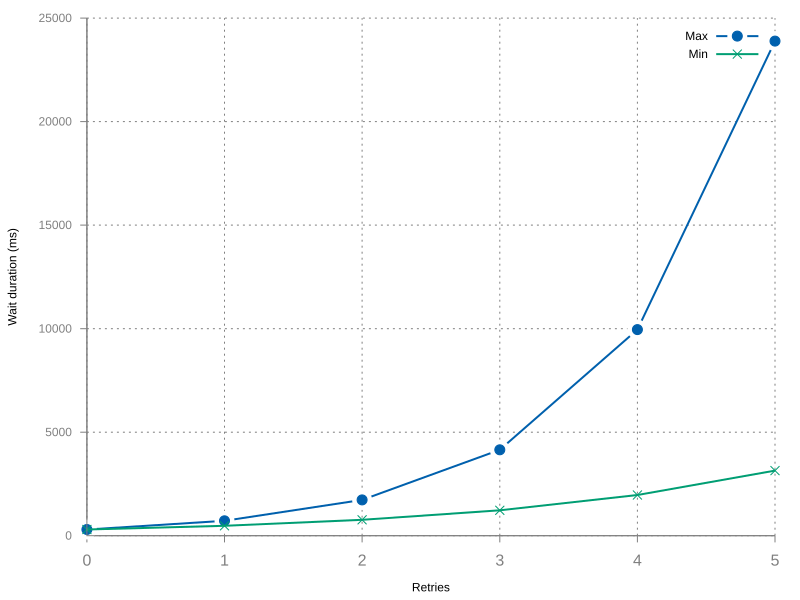

The retry mechanism uses a randomization function that grows exponentially. This formula and how the default values affect it is best described by the example below:

## Retry Options Reference

| option              | description                                                                                                             | default             | type       | required |
| ------------------- | ----------------------------------------------------------------------------------------------------------------------- | ------------------- | ---------- | -------- |
| maxRetryTime        | Maximum wait time for a retry in milliseconds. The retry time will never exceed this value                              | `30000`             | `Number`   | No       |
| initialRetryTime    | Initial value used to calculate the retry in milliseconds (This is still randomized following the randomization factor) | `300`               | `Number`   | No       |
| factor              | Randomization factor. Determines the range of randomness applied to each retry delay                                   | `0.2`               | `Number`   | No       |
| multiplier          | Exponential factor. Each retry delay is multiplied by this value                                                        | `2`                 | `Number`   | No       |
| retries             | Max number of retries per call. Set to `0` to disable retries                                                           | `5`                 | `Number`   | No       |
| restartOnFailure    | Only used in consumer. Async function called when all retries are exhausted, to decide whether to restart               | `async () => true`  | `Function` | No       |

## How the Retry Formula Works

- 1st retry:
  - Always a flat `initialRetryTime` ms
  - Default: `300ms`
- Nth retry:
  - Formula: `Random(previousRetryTime * (1 - factor), previousRetryTime * (1 + factor)) * multiplier`
  - N = 1:
    - Since `previousRetryTime == initialRetryTime` just plug the values in the formula:
    - Random(300 * (1 - 0.2), 300 * (1 + 0.2)) * 2 => Random(240, 360) * 2 => (480, 720) ms
    - Hence, somewhere between `480ms` to `720ms`
  - N = 2:
    - Since `previousRetryTime` from N = 1 was in a range between 480ms and 720ms, the retry for this step will be in the range of:
    - `previousRetryTime = 480ms` => Random(480 * (1 - 0.2), 480 * (1 + 0.2)) * 2 => Random(384, 576) * 2 => (768, 1152) ms
    - `previousRetryTime = 720ms` => Random(720 * (1 - 0.2), 720 * (1 + 0.2)) * 2 => Random(576, 864) * 2 => (1152, 1728) ms
    - Hence, somewhere between `768ms` to `1728ms`
  - And so on...

The retry time is capped at `maxRetryTime` (default `30000ms`). Once the calculated delay exceeds this value, all subsequent retries will use `maxRetryTime` as the delay.

## Example Retry Timeline (with defaults)

| Retry # | Min Delay (ms) | Max Delay (ms) |
|---------|----------------|----------------|
| 1       | 300            | 300            |
| 2       | 480            | 720            |
| 3       | 768            | 1,728          |
| 4       | 1,229          | 4,147          |
| 5       | 1,966          | 9,953          |

> After 5 retries (default), `KafkaJSNumberOfRetriesExceeded` is thrown.

## Configuration Examples

### Conservative retry (fewer retries, longer waits)

```javascript
const kafka = new Kafka({
  brokers: ['kafka1:9092'],
  retry: {
    initialRetryTime: 1000,
    maxRetryTime: 60000,
    retries: 3,
    factor: 0.2,
    multiplier: 3,
  }
})
```

### Aggressive retry (more retries, shorter waits)

```javascript
const kafka = new Kafka({
  brokers: ['kafka1:9092'],
  retry: {
    initialRetryTime: 100,
    maxRetryTime: 30000,
    retries: 10,
    factor: 0.2,
    multiplier: 2,
  }
})
```

### Disable retries

```javascript
const kafka = new Kafka({
  brokers: ['kafka1:9092'],
  retry: {
    retries: 0,
  }
})
```

## Where Retry is Used

The retry configuration can be set at multiple levels:

| Level    | Description                                                                                            |
|----------|--------------------------------------------------------------------------------------------------------|
| Client   | `new Kafka({ retry: { ... } })` — Default retry for all operations                                    |
| Producer | `kafka.producer({ retry: { ... } })` — Overrides client retry for producer operations                 |
| Consumer | `kafka.consumer({ retry: { ... } })` — Overrides client retry for consumer operations. Also supports `restartOnFailure` |
| Admin    | `kafka.admin({ retry: { ... } })` — Overrides client retry for admin operations                       |

### Consumer-specific: `restartOnFailure`

The `restartOnFailure` option is only available in the consumer's retry config. It determines what happens after all retries are exhausted:

```javascript
const consumer = kafka.consumer({
  groupId: 'my-group',
  retry: {
    retries: 5,
    restartOnFailure: async (error) => {
      // Return true to restart, false to stop
      console.error('Consumer crashed:', error.message)

      // Example: don't restart on authorization errors
      if (error.name === 'KafkaJSAuthorizationError') {
        return false
      }

      return true
    }
  }
})
```

See [Configuration - restartOnFailure](Configuration.md#restartonfailure) for more details.

## Error Types

| Error                              | Description                                                       |
|------------------------------------|-------------------------------------------------------------------|
| `KafkaJSNumberOfRetriesExceeded`   | Thrown when max retries are exhausted. Contains the original error |
| `KafkaJSNonRetriableError`         | Thrown for errors that should not be retried                       |

KafkaJS distinguishes between retriable and non-retriable errors. Only retriable errors trigger the retry mechanism. [See the Kafka protocol error codes](https://kafka.apache.org/protocol#protocol_error_codes) for the list of retriable errors.


